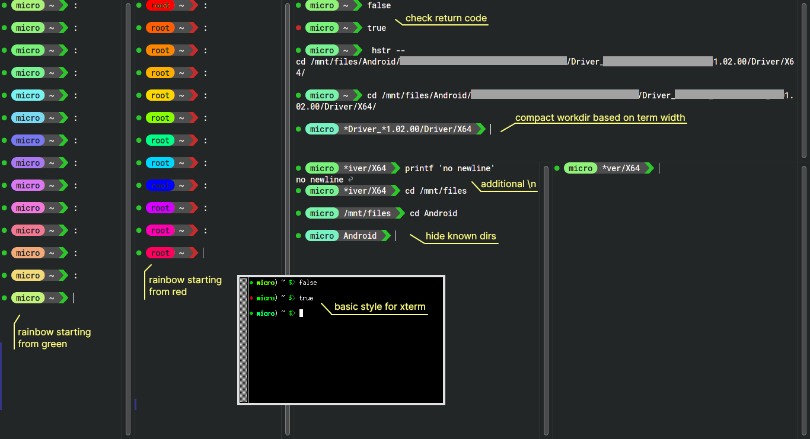

## Personal prompt

### Requirements

- patched font with nerd symbols
- terminal with correct glyphs aligning — [konsole fix](https://github.com/powerline/fonts/issues/31#issuecomment-1023622834) (fontconfig tweak)
- bash — _untested on others_
- optionals
    - python — rainbow colors static generation (`gen_rgb_rainbow`)

### Installation

Put `prompt.sh` whatever you like and `source` it inside `~/.bashrc` or `/etc/bash.bashrc`.

 

### Features

- **colors**
    - full, 256, 8
    - 🌈 rainbow animation (advance on new prompt)
    - 🟩 user — 🟥 root
    - (hack) detect light theme
- **styles**
    - $\{\text{powerline}, \text{basic}\} \times \{\text{long},\text{short}\}$
- different **combinations** of colors/style based on terminal
    - xterm — reverse video, basic, long, 256
    - vscode — powerline, short, 256
    - idea — powerline, short, full (_untested_)
    - kate — powerline, short, full
    - konsole — powerline, long, full
- **behavior**
    - detect return code
    - detect whether command is bound to an hotkey
    - compact workdir based on terminal width and known paths
    - stay on previous line if no command is given
    - normalize output not ending with newline
- unimplemented (technical limitations)
    - _update_ and reprint prompt right after resize
        - libreadline does not retrieve new prompt
